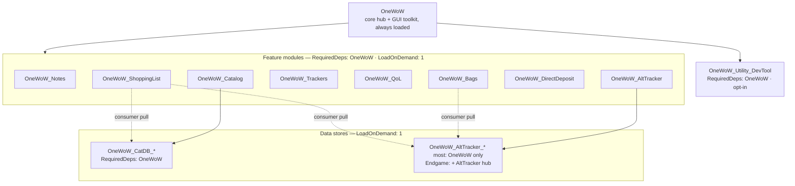

# OneWoW Suite Architecture

Authoritative reference for how the suite is partitioned, loaded, enabled, and
integrated. Describes **what is implemented today**.

## Contents

1. [True-core model](#1-true-core-model)
2. [Load-unit tiers and TOC summary](#2-load-unit-tiers-and-toc-summary)
3. [Load lifecycle](#3-load-lifecycle)
4. [Enable model](#4-enable-model)
5. [Hub UI](#5-hub-ui)
6. [Cross-unit sharing](#6-cross-unit-sharing)
7. [Taxonomy](#7-taxonomy)
8. [GUI and settings integration](#8-gui-and-settings-integration)
9. [Caveats](#9-caveats)
10. [File reference](#10-file-reference)

---

## 1. True-core model

The suite ships as **separate addons** (load units / TOCs) but behaves as one
product. `OneWoW` is the always-loaded hub and contains the shared UI toolkit
(the `OneWoW_GUI` global, absorbed from the former `OneWoW_GUI` addon — §8.1).
Feature modules and data stores are `## LoadOnDemand: 1` with
`RequiredDeps: OneWoW` — nothing auto-loads except core. The orchestrator
force-loads enabled units at startup and drives initialization in deterministic
order (§3).

### Why separate TOCs (not one mega-addon)

Manage Features uses `C_AddOns.DisableAddOn` + `ReloadUI` to **truly unload** heavy
modules and multi-MB data tables. A single literal TOC would parse every file at
login; disabling could only skip runtime work — Lua and data stay resident. **Per-module
TOCs preserve real unload.**

Distribution is one package / one install; **load units stay many**. Separate
CurseForge pages were the tracking burden, not separate folders.



---

## 2. Load-unit tiers and TOC summary

| Tier | Units | Loads | Mechanism |
|---|---|---|---|
| **1 — Core hub** | `OneWoW` | Always | Orchestrator, Manage Features, hub UI, shared engines, GUI toolkit (`OneWoW_GUI` global) |
| **2 — Feature modules** | AltTracker, Catalog, Notes, Trackers, QoL, ShoppingList, DirectDeposit, Bags | On demand | `RequiredDeps: OneWoW` + `LoadOnDemand: 1` |
| **3 — Data stores** | `OneWoW_AltTracker_*`, `OneWoW_CatDB_*` | On demand | Owned under `ModuleManifest.stores`. Most stores: `RequiredDeps: OneWoW` (consumers may load without the owning hub). **Exception:** Endgame still `RequiredDeps: …, OneWoW_AltTracker` (`parentRequiredStores`). Catalog Home / Manage Features stores are CatDB (Zones, NPCs, Items, Quests, Tradeskills). `PackResolver` always returns CatDB. |
| **4 — Utility** | `OneWoW_Utility_DevTool` | On demand, opt-in | `RequiredDeps: OneWoW` + `LoadOnDemand: 1`; soft-opted-out on a fresh account and excluded from recommended preset; `loadPhase = "login"` when wanted |

Verified against current `.toc` files:

| Load unit | RequiredDeps | OptionalDeps | LoadOnDemand |
|---|---|---|---|
| **OneWoW** | — | Auctionator, TradeSkillMaster | — |
| **OneWoW_Notes** | OneWoW | — | 1 |
| **OneWoW_AltTracker** | OneWoW | — | 1 |
| **OneWoW_Catalog** | OneWoW | — | 1 |
| **OneWoW_Trackers** | OneWoW | TradeSkillMaster, Auctionator | 1 |
| **OneWoW_QoL** | OneWoW | — | 1 |
| **OneWoW_ShoppingList** | OneWoW | — | 1 |
| **OneWoW_DirectDeposit** | OneWoW | — | 1 |
| **OneWoW_Bags** | OneWoW | TradeSkillMaster, Baganator, Masque | 1 |
| **OneWoW_Utility_DevTool** | OneWoW | !BugGrabber | 1 |
| **OneWoW_AltTracker_\*** (except Endgame) | OneWoW | — | 1 |
| **OneWoW_AltTracker_Endgame** | OneWoW, OneWoW_AltTracker | — | 1 |
| **OneWoW_CatDB_\*** | OneWoW | — | 1 (Catalog packs: `lazyStores`; parse on tab / quest event / Item Search source) |

### OptionalDeps policy

**Do not use `## OptionalDeps` for suite-internal features.** Blizzard auto-loads
enabled OptionalDeps when the consumer is `LoadAddOn`'d — bypassing soft opt-out
and the login orchestrator. Suite integrations use nil-guards at call sites and,
for explicit user actions, `OneWoW:WithAddon` / `EnsureLoaded` (§3.8).

External third-party addons (TSM, Auctionator, Baganator, Masque, `!BugGrabber`)
remain valid OptionalDeps.

---

## 3. Load lifecycle

Core owns *when* a unit loads, *when* it initializes, and lifecycle event dispatch.
Handler fans (`Register*Handler`, addon-loaded watchers, scan callbacks) isolate
failures via `pcall` and forward errors through `geterrorhandler()` so one handler
cannot break the fan-out yet errors still surface.

### 3.1 Why core-driven loading (retired `LoadWith`)

`LoadWith` auto-loads a dependency inside the parent's load. When
`C_AddOns.LoadAddOn` runs inside another addon's `ADDON_LOADED`, WoW does **not**
deliver the loaded module's own `ADDON_LOADED` — its DB setup never ran. Stores are
listed under each parent in `ModuleManifest.stores`; the orchestrator `EnsureLoaded`s
each explicitly after the parent, driving `OnAddonLoaded` deterministically.

Precedent: DBM loads mods with `LoadAddOn` then runs core-driven post-load init —
same pattern as our `OnAddonLoaded` hook.

### 3.2 Orchestrator + manifest

`OneWoW/Core/AddonLoader.lua` holds `OneWoW.ModuleManifest` (every suite unit,
slash command, hub `module` name, hub `tabOrder`, `loadPhase`, parent `stores`).
At the **end of core's `ADDON_LOADED`** (before `PLAYER_LOGIN`),
`OneWoW.LoadOrchestrator:RunStartupPhase()` walks the manifest in **array order**
and calls `OneWoW:BringUp(addon)` for each `loadPhase == "login"` entry (feature
+ stores as one set) that is not soft-opted-out. **`OneWoW_Utility_DevTool` uses
the same path** — it is not skipped by the orchestrator. Utilities
(`FirstRun.CATALOG` group `utility`) are opt-in: a fresh account seeds an
account-wide soft opt-out before `RunStartupPhase` (Blizzard enable stays on, so
Manage Features can `LoadAddOn` later this session). They are also excluded from
the recommended preset. When wanted (Blizzard-enabled and not soft-opted-out),
they load at login like other manifest entries.

**Load order** is manifest array order. **Hub section dropdown order** is the
explicit `tabOrder` field on entries with `module` (Notes → AltTracker → Catalog →
Trackers → QoL today), between Home and Settings. `GetModuleTabOrder` /
`GetAlwaysShowModules` read `tabOrder`; missing or unknown module names fall back
to 99. New hub modules must set both `module` and `tabOrder`.

```lua
{ addon = "OneWoW_Notes", module = "notes", tabOrder = 1, loadPhase = "login", ... }
```

### 3.3 Event ownership

A single core event frame in **`Core/Events.lua`** registers `ADDON_LOADED`,
`PLAYER_LOGIN`, and `PLAYER_ENTERING_WORLD` and routes them into suite lifecycle
dispatch (`DispatchAddonLoaded` / `RunCoreLoginSequence` / `DispatchEnteringWorld`).
It also exposes a **core-only** multiplexer — `ns.RegisterEvent(event, ownerID, fn)`
and `ns.UnregisterEvent(event, ownerID)` — so other core files share that one frame
for **gameplay** events instead of each creating their own (e.g.
`OneWoW.Restriction` listens for `PLAYER_REGEN_*` and
`ADDON_RESTRICTION_STATE_CHANGED` this way, §8.6). `ns.RegisterEvent` **rejects**
the three lifecycle events: they must flow through the ordered dispatch, not a flat
fan-out. The GUI toolkit's settings bootstrap
(`OneWoW_GUI:InitializeSettings()` in `GUI/Settings.lua`) is called from core's
`OnAddonLoaded` — it no longer self-registers `ADDON_LOADED`. Embedded `Libs/` are
unchanged.

| Registrar | Allowed? |
|-----------|----------|
| `Core/Events.lua` | Yes — sole lifecycle authority + core gameplay-event multiplexer |
| Embedded `Libs/` | Yes — third-party, off-limits |
| Feature modules, stores, DevTool, sub-modules | **No** — chain up to manifest parent |

Orchestrated units may still `RegisterEvent` on their own frame for **gameplay** WoW
events (`PLAYER_ALIVE`, `BAG_UPDATE`, `ZONE_CHANGED`, …). Only the three
**lifecycle** events above must route through core dispatch. For data stores,
entering-world collection belongs in `BootStore` `onEnteringWorld` (or
`RegisterEnteringWorldHandler` on the store namespace), not a raw
`PLAYER_ENTERING_WORLD` frame.

### 3.4 `OnAddonLoaded`

All unit `OnAddonLoaded` paths funnel through `OneWoW:DispatchUnitOnAddonLoaded`
(`Core/Lifecycle.lua`), which dispatches the hook **at most once per unit per
session**. Three drivers call it:

1. `hooksecurefunc(C_AddOns, "LoadAddOn", …)` → `RunPostLoadInit` →
   `DispatchUnitOnAddonLoaded` (primary path for force-loaded LoD units).
2. `OneWoW:DispatchAddonLoaded` for auto-loaded manifest units that receive WoW's
   own `ADDON_LOADED`.
3. `OneWoW:RunManifestLoginPhase` as a safety net at `PLAYER_LOGIN` for units
   whose hook was somehow not driven by the LoadAddOn path — repeat calls are a
   no-op thanks to the central guard.

The LoadAddOn hook drives **`OnAddonLoaded` only** — `OnPlayerLogin` /
`OnPlayerEnteringWorld` are driven by `Settle` / `BringUp` (§3.5–3.6). LoD units
force-loaded during core's `ADDON_LOADED` never receive their own WoW
`ADDON_LOADED`.

**Dispatch is manifest-gated.** `DispatchUnitOnAddonLoaded` only runs the hook
for `ModuleManifest` units (roots and their `stores`), checked via
`OneWoW:IsManifestUnit` (`Core/AddonLoader.lua`). A Blizzard or third-party
addon whose `_G` table happens to define `OnAddonLoaded` is never treated as a
suite load unit; a suppressed would-have-run hook records `dispatch.skip`
(§3.11). Addon-loaded **watchers** (§3.4.1) remain ungated — they observe every
addon load, manifest or not.

Data stores use `OneWoW:BootStore(ns, config)` (`Core/StoreBootstrap.lua`).

### 3.4.1 Addon-available notification (watchers)

`RegisterAddonLoadedWatcher(addonName, fn)` is the "wire when addon X becomes
available" primitive — the suite analogue of WoW's `ADDON_LOADED`. Fan-out runs
through `OneWoW:NotifyAddonLoadedWatchers`, gated **at most once per addon name per
session**. Two drivers feed it, mirroring the two real load paths:

1. WoW `ADDON_LOADED` → `OneWoW:DispatchAddonLoaded` → `NotifyAddonLoadedWatchers`.
2. Any `C_AddOns.LoadAddOn` (orchestrator force-load, `BringUp`, on-demand) →
   `RunPostLoadInit` → `NotifyAddonLoadedWatchers`.

Both drivers run the manifest unit's `OnAddonLoaded` (via
`DispatchUnitOnAddonLoaded`) **before** the watcher fan-out, so a watcher can rely
on the loaded unit's init having completed.

**Registration-time catch-up:** a filtered watcher whose addon already loaded
before the watcher registered (e.g. external bag addons that sort alphabetically
before `OneWoW`, so their `ADDON_LOADED` already fired) runs `fn` immediately at
registration. This catch-up is deliberately independent of the per-session dedup
set, so a late registrant still fires exactly once. Combined with idempotent setup
guards in the watcher body, this makes wiring order-insensitive across cold start,
mid-session enable, and already-loaded cases.

**Wildcard watchers (`addonName = nil`/`"*"`) observe every load, by design.** This
mirrors WoW's `ADDON_LOADED`, under which every addon is notified of every other
addon's load. The pre-fix gap was that suite LoD units force-loaded inside core's
`ADDON_LOADED` had their own child `ADDON_LOADED` suppressed by WoW (§3.1), so
wildcard watchers silently missed them. Routing `RunPostLoadInit` through
`NotifyAddonLoadedWatchers` restores WoW-native completeness: a wildcard watcher now
sees suite-internal force-loads too. Wildcard watchers get no registration catch-up
(there is no single addon to replay) — they observe loads from registration onward.

Use watchers for "wire when addon X is available." Use `RegisterCoreLoginHandler`
only for login-scoped work unrelated to addon load — **not** as an "if addon loaded
at login" check, which misses mid-session and force-load paths.

### 3.4.2 Data-available notification (data-ready watchers)

There are **two distinct boundaries** for a provider:

- **Load boundary** — `ns.FeatureStateChanged` (fired from the `LoadAddOn` hook and
  `SetFeatureOptOut`). Means "this unit is now loaded / its opt-out changed." Drives
  showing/hiding tabs, rebuilding placeholders, and Home status. It fires **before**
  the unit's `OnPlayerLogin`.
- **Data boundary** — `OneWoW:SignalDataReady(addonName)`. Means "this provider's
  data is now queryable." Drives populating/refreshing data views.

The two are not interchangeable: providers register/init their queryable data in
`OnPlayerLogin` (stores finish their initial collection / publish `_API`
surfaces), which runs **after** `ns.FeatureStateChanged`. Reading provider data
on the load boundary therefore sees it as still missing (a one-event-delayed
reaction). Use the data boundary instead.

`RegisterDataReadyWatcher(addonName, fn)` is the data-boundary analogue of
`RegisterAddonLoadedWatcher`, with the same **registration-time catch-up**: a
filtered watcher whose provider is already ready fires `fn` once immediately, so a
consumer (or a tab) built after readiness is not stranded — this replaces the
ad-hoc `C_Timer.After` retries consumers used to poll for late registration.
Wildcard (`nil`/`"*"`) watchers get no catch-up. `dataReadySet` is monotonic per
session, so `SignalDataReady` fans out at most once per addon; watcher setup fns
must still be idempotent (catch-up plus a later signal can both reach a late
registrant, and scan-callback registration is not dedup-safe). `IsDataReady(addonName)`
queries the flag.

**Auto-fired by the store lifecycle:** `BootStore`'s `OnPlayerLogin`
(`Core/StoreBootstrap.lua`) calls `OneWoW:SignalDataReady(config.addonName)` after
`onLogin` and the login handlers run, so **every** data store emits the signal when
its login init completes — Catalog data units and `OneWoW_AltTracker_Storage`
included, with no provider-side code. Stores nobody watches fire harmless no-ops.
Non-store (hub) providers may call `SignalDataReady` explicitly when their data is
ready.

#### Ready → change → read compose

Data-ready is the **precursor**: a provider must be ready before its data can
change or be safely queried. Consumers compose three layers:

| Layer | API | Cadence | Use when |
|---|---|---|---|
| **Data-ready** | `RegisterDataReadyWatcher(addonName, fn)` | Once per addon per session (+ registration catch-up) | Long-lived UI built before a LoD store; enable controls; subscribe to change buses; wipe caches poisoned by absence |
| **Provider change** | e.g. `OneWoW_AltTracker_Storage_API.RegisterStorageChanged` | Many times after writes | Live views over mutative Storage (bags / banks / mail). Subscribe **only after** data-ready |
| **Call-time `_API`** | `if OneWoW_X_API then … end` | Each use | Ephemeral UI (tooltips, one-shot dialogs) — next use sees mid-session ready with no watcher |

**Today only Storage exposes a change bus** (`RegisterStorageChanged`). Catalog
data packs and most other stores are static after ready — data-ready alone is
enough. Character and other AltTracker stores have no `Register*Changed` yet;
hub tabs refresh on data-ready plus their own gameplay events.

**Canonical compose** (ShoppingList `DataAccess`, AltTracker Items tab):

1. `RegisterDataReadyWatcher("OneWoW_AltTracker_Storage", …)`
2. Inside: `RegisterStorageChanged(refresh)` + one immediate refresh
3. All reads go through `_API` (nil → empty)

**Nil-guard recovery rule:** If UI or logic treats provider absence as a *sticky*
state (disabled button, cached `false`, “not detected” status), it **must** also
`RegisterDataReadyWatcher` so the surface becomes usable when the provider
arrives mid-session. Do not snapshot `IsAddOnLoaded` / missing `_API` into an
upvalue that never updates. Pure call-time reads (e.g. Bags gold tooltip, QoL
item-tracker tooltip) need no watcher — they re-check `_API` on each use.

There is no core `DataManager:Query` broker. Cross-unit contracts are explicit
`OneWoW_<Unit>_API` globals plus the readiness / change patterns above.

### 3.5 `OnPlayerLogin`

At core `PLAYER_LOGIN`, `Core/Events.lua` invokes `ns:RunCoreLoginSequence()`
(defined in `OneWoW.lua`, kept there for file-local access to `ADDON_NAME` and the
banner/wizard helpers): `OneWoW:FireCoreLoginHandlers("early")` (feature inits),
then the load banner, then `OneWoW:FireCoreLoginHandlers("late")` (integrations),
then `OneWoW:RunManifestLoginPhase()` walks the manifest and calls
`DispatchUnitOnAddonLoaded` (safety net; no-op when already run) then `OnPlayerLogin()`
on each loaded unit.

**Core login handlers are phased.** `RegisterCoreLoginHandler(id, fn, phase)`
takes `phase = "early"` (before the load banner — core feature `Initialize()`
calls, registered at the bottom of each feature file) or `"late"` (default —
after the banner; external-addon integrations like Bagnon, toast wiring).

**Handlers within a phase must be order-independent.** A handler that needs
another subsystem initialized must express that in code (call it, or make the
dependency lazy/idempotent) — never rely on registration (TOC load) order. This
is what lets a handler relocate to another load unit without ordering
regressions.

Mid-session loads use `OneWoW:BringUp(addon)`: loads `{ addon, ...stores }`
(except `lazyStores`, which stay out of the batch), then one
`Settle` pass (`OnPlayerLogin` over the set) so a parent's login runs only after its
eager stores are loaded — matching cold start. Catalog packs parse when a
pack-backed tab, quest event, or Item Search source asks (`EnsureLoaded`).

### 3.6 `OnPlayerEnteringWorld`

On every `PLAYER_ENTERING_WORLD`, `OneWoW:DispatchEnteringWorld(isLogin, isReload)`
computes `isZoning = not isLogin and not isReload` and fans out to all loaded
manifest units.

Mid-session loads missed the real event; `BringUp` (and the lone-load path in the
`LoadAddOn` hook) delivers synthetic catch-up `OnPlayerEnteringWorld(true, false,
false)`: `isLogin=true` mirrors cold start; `isZoning=false` avoids spurious zone
refresh. No synthetic PEW at cold start/reload.

### 3.7 Chain-up pattern

Manifest roots call `OneWoW.Lifecycle:CreateHandlerRegistry(self)` in
`OnAddonLoaded`. Sub-modules register with the parent — never with WoW events:

```lua
parent:RegisterLoginHandler("feature", fn)
parent:RegisterEnteringWorldHandler("feature", function(isLogin, isReload, isZoning)
    if isZoning then ... end
end)
parent:RegisterAddonLoadedWatcher("Blizzard_Foo", fn)
```

| I need to… | Do this | Do NOT |
|------------|---------|--------|
| Init my module DB | `OnAddonLoaded()` on manifest root | `RegisterEvent("ADDON_LOADED")` |
| Arm at login | `OnPlayerLogin()` or `RegisterLoginHandler` | `RegisterEvent("PLAYER_LOGIN")` |
| React to zone change | `OnPlayerEnteringWorld` with `if isZoning` | `RegisterEvent("PLAYER_ENTERING_WORLD")` |
| Hook Blizzard_Foo when it loads | `RegisterAddonLoadedWatcher("Blizzard_Foo", fn)` | Own `ADDON_LOADED` frame |

### 3.8 Loader API

```lua
OneWoW:EnsureLoaded(name [, opts])              -> ok, reason?
OneWoW:WithAddon(name, onReady, onFail, opts)   -> ok
OneWoW:BringUp(addonName)                        -- feature + owned stores + CATALOG consumer pulls, then Settle (+ mid-session PEW catch-up)
OneWoW:GetLoadFailureText(reason)               -> localized string
OneWoW:StoreRequiresParent(storeName)           -> true when soft parent opt-out must block load
OneWoW:CreateItemDataLoader(dbTable)            -> ItemDataLoader (shared async item-cache factory)
```

- **Soft opt-out enforced:** returns `"OPTED_OUT"` when the unit itself is opted out,
  or when `StoreRequiresParent(unit)` and the manifest parent is opted out
  (`parentRequiredStores`: Endgame only). Other AltTracker and all Catalog packs
  load with the owning hub soft-opted-out.
- **`BringUp` consumer pulls:** appends `FirstRun.CATALOG[].datastores` for the
  feature (e.g. Bags → Storage + Character) so a Bags-only install loads data
  without AltTracker.
- **`{ deferInCombat = true }`** queues to `PLAYER_REGEN_ENABLED`.
- **Lazy Catalog packs:** Catalog `lazyStores` are skipped by login `BringUp` and
  the startup store pass. Opening a `requiresAddon` tab, a quest event (scanner),
  or an Item Search source is the load trigger — explicit user (or gameplay)
  action, not a speculative preload.
- **Lazy cross-module data:** reserve `WithAddon` for *explicit user actions* (e.g.
  Catalog AH scan → `OneWoW_AltTracker_Auctions`), not speculative tab opens.
- **The funnel is mandatory.** Raw `C_AddOns.LoadAddOn` / `UIParentLoadAddOn` calls
  are forbidden everywhere except `Core/AddonLoader.lua` and `Core/Lifecycle.lua` —
  they bypass soft opt-out and combat deferral, and skip load tracing. This applies
  to Blizzard LoD addons too (`EnsureLoaded("Blizzard_InspectUI")` works for them;
  opt-out policy simply never matches). Enforced by pre-commit `no-raw-loadaddon`
  (§3.10); rare legitimate exceptions use `-- noqa: loadaddon` on the line.

### 3.9 Load phases

| Phase | When loaded | Use for |
|---|---|---|
| `login` | End of core `ADDON_LOADED` if wanted | Passive hooks: tooltips, overlays, toasts, automations |
| `lazy` | First hub tab / window open | Pure-window modules with no passive behavior |

All manifest entries are `login` today. `lazy` defers until `EnsureModuleForTab` in
`MainWindow` (dormant while everything is `login`).

### 3.10 Enforcement

| Rule | Mechanism |
|---|---|
| No lifecycle `RegisterEvent` in orchestrated units | `bin/check_suite_lifecycle.py` (pre-commit `no-suite-lifecycle-events`) |
| No raw `LoadAddOn` outside the loader funnel (§3.8) | `bin/check_no_raw_loadaddon.py` (pre-commit `no-raw-loadaddon`) |
| No suite-internal `OptionalDeps` | `bin/check_toc_optional_deps.py` (pre-commit `no-suite-internal-optionaldeps`) |
| Manifest ↔ CATALOG consumer-graph invariants (§4.1) | `bin/check_manifest_catalog_alignment.py` (pre-commit `manifest-catalog-alignment`) |
| No direct `db.global.settings` access (§8.5) | `bin/check_no_settings_bypass.py` (pre-commit `no-settings-bypass`) |
| No direct combat/restriction/secret API calls (§8.6) | `bin/check_no_restriction_bypass.py` (pre-commit `restriction-funnel`) |
| No registering core-owned events outside their funnel owner (§8.7 / §8.8 / §8.9) | `bin/check_no_core_event_bypass.py` (pre-commit `core-event-funnel`; `EVENT_OWNER` registry: `MERCHANT_*`→`Merchant.lua`, `TRADE_SKILL_*` / `NEW_RECIPE_LEARNED`→`ProfessionRecipe.lua`, bag/bank/`ITEM_LOCK_CHANGED`/`GUILDBANK*`→`Inventory.lua`; escape hatch `-- noqa: core-event-funnel`) |
| No cross-load-unit SavedVariables access (§6/§7) | `bin/check_no_data_manager_bypass.py` (TOC-derived ownership; **enforced** — hard-fails off the `ALLOWED_FOREIGN_SV` allowlist) |
| No namespace publish / global-surface anti-patterns (§6.1) | `bin/check_no_namespace_publish.py` (pre-commit `no-namespace-publish`; enforced) |
| No per-addon `Media/` folders (hub-only assets) | `bin/check_no_per_addon_media.py` (pre-commit `no-per-addon-media`) |
| No `_G.literal` access | `bin/check_no_g_literal.py` |
| Agent guidance | `.cursor/rules/OneWoW-Suite-Architecture.mdc`, `onewow-suite-architecture` skill |

### 3.11 Lifecycle trace (`/1wtrace`)

`Core/Lifecycle.lua` carries an opt-in tracer that records the dispatch/load
sequence into an in-memory ring buffer (`Lifecycle.Trace`, 1024 entries) and
prints it to chat. It exists to answer "is the lifecycle doing what we think?"
in-game — there is otherwise no visibility into the success path of dispatch.

| Command | Action |
|---|---|
| `/1wtrace on` | Enable recording (clears ring), persist the flag |
| `/1wtrace off` | Disable recording (persist) |
| `/1wtrace clear` | Clear the ring |
| `/1wtrace dump` | Print the buffer, oldest-first, as a `[+Δs] phase unit detail` timeline |
| `/1wtrace` | Usage + current recording state |

Strings are hardcoded English (dev tool, not user-facing UI).

**Capturing startup is the design constraint.** The whole orchestration
(`RunStartupPhase` → `BringUp` → `LoadAddOn` hook → `RunManifestLoginPhase` →
`DispatchEnteringWorld`) runs inside core's `ADDON_LOADED`, before any command
can be typed. So the **enable flag persists** in `OneWoW_DB.global.debugTrace` (default
`false`, in `Core/Database.lua` defaults) and is read back by `Trace:Sync()` in
`OneWoW:OnAddonLoaded` right after `InitializeDatabase` — before the orchestrator
runs. Workflow: `/1wtrace on` → `/reload` → `/1wtrace dump`. The **ring is
session-only** (cleared each `Sync`), so a dump always reflects the current
session. `Dump` prints `min(count, RING_SIZE)` lines.

`OneWoW:TraceRecord(phase, unit, detail)` is the single record API — a cheap
no-op when disabled — called from the lifecycle funnels in `Lifecycle.lua` and
`AddonLoader.lua`. Recorded phases:

| Phase | Source | Meaning |
|---|---|---|
| `startup.begin` / `startup.end` | `RunStartupPhase` | Orchestrator login-phase pass bounds |
| `bringUp.begin` / `bringUp.end` | `BringUp` | Feature+stores batch (`midSession`, `units`, `loaded`) |
| `ensureLoaded` / `ensureLoaded.skip` | `EnsureLoaded` | Load outcome (`ok`, `reason`) or skip (`OPTED_OUT`/`COMBAT`) |
| `loadAddOn.hook` | `LoadAddOn` post-hook | Every load path's single chokepoint (`inBringUp`) |
| `OnAddonLoaded` / `OnPlayerLogin` / `OnPlayerEnteringWorld` | `Lifecycle.RunUnitHook` | Per-unit hook **fires** (recorded only when the hook exists); defined in `Lifecycle.lua`, called from `AddonLoader.lua` too |
| `dispatch.skip` | `DispatchUnitOnAddonLoaded` | Manifest gate suppressed a non-manifest unit's `OnAddonLoaded` (`reason=NOT_MANIFEST`; recorded only when the hook exists) |
| `optOut.clear` | `AddonList_LoadAddOn` post-hook | Blizzard addon-list Load button cleared a per-character soft opt-out (`scope`, `source`) |
| `watchers.notify` / `watcher.catchup` | `NotifyAddonLoadedWatchers`, registration catch-up | Addon-loaded watcher fan-out and late-registrant replay |
| `manifest.loginPhase` | `RunManifestLoginPhase` | Login walk start |
| `core.loginHandlers` / `core.enteringWorldHandlers` | `FireCore*Handlers` | Core handler fans (`count`; login records once per `phase` — `early` then `late`) |
| `enteringWorld` | `DispatchEnteringWorld` | Real PEW (`isLogin`, `isReload`, `isZoning`) |
| `catchUpPEW` | `CatchUpEnteringWorld` | Synthetic mid-session PEW catch-up (attempted per unit) |
| `defer.combat` / `combat.flush` | `WithAddon`, combat frame | Combat-deferred load queue/flush |
| `error` | `SafeCall` failure | Handler-fan failure, in sequence (complements DevTool ErrorLogger) |

`catchUpPEW` fires for every unit in the set while `OnPlayerEnteringWorld` only
follows for units that implement the hook — the pair reads as attempt-vs-actual.

---

## 4. Enable model

Two layers:

1. **Blizzard per-addon enable** (`C_AddOns.{Enable,Disable}AddOn`) — hard layer.
   Disabling truly unloads after reload. Re-enabling a login-disabled unit needs
   reload (`LoadAddOn` returns `DISABLED` mid-session).

2. **Soft opt-out** (`OneWoW_DB.global.featureOptOut`) — unit stays Blizzard-enabled;
   orchestrator skips loading. Can `LoadAddOn` later same session with no reload.

| Action | Mechanism | Reload? |
|---|---|---|
| Soft disable (Apply) | set `featureOptOut`; orchestrator skips next load | No (loaded unit stays until reload) |
| Soft enable | clear opt-out + `EnsureLoaded` / Load Addon | No |
| Hard disable (Apply & Reload) | `DisableAddOn` + clear opt-out + `ReloadUI` | Yes |
| Hard re-enable | `EnableAddOn` + `ReloadUI` | Yes |
| Load at login | orchestrator `BringUp` during core `ADDON_LOADED` | n/a |

Scope: Manage Features selects account vs current character for both layers. Home is
**read-only** — links to Manage Features for writes.

**Opt-out clears at the intent source, never in the generic load path.** The
`C_AddOns.LoadAddOn` post-hook runs init for every load but makes no policy
decisions about persisted state — a programmatic load (ours or a third-party
addon force-loading a suite unit) never alters the user's opt-out; the unit runs
for that session and the persisted choice survives the next reload. Each
explicit-enable surface owns its own clear:

| Explicit-enable surface | Who clears opt-out |
|---|---|
| Manage Features soft Apply / hard Apply / "Load now" | `FirstRunWizard.lua` writes `SetFeatureOptOut` per selection |
| Blizzard addon-list **Load Addon** button | `hooksecurefunc("AddonList_LoadAddOn", …)` in `Core/AddonLoader.lua` (char scope; traced as `optOut.clear`) |

Accepted tradeoff: the addon-list hook names a Blizzard FrameXML function. If a
future patch renames `AddonList_LoadAddOn`, the button silently stops clearing
opt-out — the unit still loads and inits via the generic hook, and Manage
Features remains the in-suite path to clear opt-out.

### 4.1 Enable-state API

```lua
OneWoW:IsAddonEnabled(name, perCharacter)
OneWoW:SetAddonEnabled(name, enabled, perCharacter)
OneWoW:IsFeatureWanted(name, perCharacter)         -- Blizzard-enabled AND not opted out
OneWoW:GetFeatureWantedAggregate(name)             -> "all"|"some"|"none"
OneWoW:GetFeatureUnitState(name)                   -> state string
OneWoW:GetAddonStatus(name, perCharacter)
OneWoW:IsFeatureOptedOut(name)
OneWoW:SetFeatureOptOut(name, optedOut, perCharacter)
OneWoW:GetManifestStoreOwner(store)                -> ModuleManifest entry|nil
OneWoW:GetCatalogDatastores(addonName)             -> string[] consumer pulls
OneWoW:GetStoreCatalogConsumers(store)             -> string[] CATALOG roots
OneWoW:EvaluateSuiteAttention()                    -> items[], loadedCount
OneWoW:DismissFeatureAttention(id)                 -- account dismiss (dismissable only)
```

**`GetFeatureUnitState` return values:**

| State | Meaning |
|---|---|
| `missing` | Addon not installed |
| `disabled` | Blizzard-disabled for current character |
| `not_loaded` | Wanted but not in memory (or soft-disabled, not loaded) |
| `pending_disable` | Soft-disabled but still loaded this session; drops next reload |
| `all` | Loaded; wanted on every known character |
| `some` | Loaded; mixed enable/opt-out across characters |

**`GetAddonStatus`** treats `IsAddOnLoaded` / `DEMAND_LOADED` as healthy — LoD units
force-loaded by the orchestrator report `loadable=false, reason="DEMAND_LOADED"` even
while working.

Manage Features' `FirstRun.CATALOG[].datastores` (consumer graph) and
`ModuleManifest.stores` (ownership graph) remain **distinct** sources of truth.
Catalog Home / Manage Features rows are the six `OneWoW_CatDB_*` stores.
Manage Features renders manifest `stores` as indented sub-rows under Catalog and
AltTracker. `storePolicy` is `optional` for both. Notes can also list
`inUnitFeatures` on its CATALOG entry (OneWay Pins today). Those use the same
sub-row chrome but are **not** load units: Apply calls the feature setter
(`OneWoW_Notes_API.SetWayPinsEnabled`) instead of `SetFeatureOptOut` /
`EnsureLoaded`. The row mutes when Notes is unchecked. AltTracker stores (except
Endgame) and all Catalog packs toggle independently of their owning hub;
Endgame stays parent-required (`parentRequiredStores` / TOC) and mutes when
AltTracker is off. Consumer pulls (Bags → Storage/Character, ShoppingList →
Storage / TradeSkillDB) still show “required by …” and stay non-interactive while
that consumer is on. Soft Apply writes per-store `SetFeatureOptOut` and
`EnsureLoaded`s wanted-but-unloaded **eager** stores; cold start also
`EnsureLoaded`s opted-in eager stores whose hub was skipped. Catalog
`lazyStores` stay unloaded until a tab / quest event / Item Search source.
See
[`OneWoW_Catalog/README.md#disabling-data-modules`](../../OneWoW_Catalog/README.md#disabling-data-modules)
for per-pack impact detail.

**Alignment check** (`bin/check_manifest_catalog_alignment.py`, pre-commit
`manifest-catalog-alignment`) enforces invariants without collapsing the two
graphs:

1. Every `FirstRun.CATALOG.addonName` exists in `ModuleManifest`.
2. Every consumer `datastores` entry appears in some `ModuleManifest.stores`.
3. Every manifest store has a `STORE_LABEL_KEYS` entry and a TOC folder.
4. `parentRequiredStores` ⊆ that parent's `stores`; TOC `RequiredDeps` includes
   the owning hub **iff** the store is parent-required.

It does **not** require hubs to list their own packs in `datastores`, or every
owned store to appear in some consumer list.

### 4.2 Home tab live refresh

`UI/t-home.lua` builds a `FirstRun.CATALOG` addon card grid once (identity chrome
above it unchanged). Each card's `ApplyState()` re-reads `GetFeatureUnitState`.
The summary bar and named attention list come from
`OneWoW:EvaluateSuiteAttention()` in `Core/FeatureHealth.lua` (composes the §4.1
enable API + ownership/consumer graphs — not a third enable layer).

**Attention classes** (intentional soft or hard off of a unit is silent for that
unit unless a still-wanted dependent is impacted):

| Class | Meaning | Dismissable? |
|---|---|---|
| `load_pending` | Soft-wanted (`IsFeatureWanted`) but not in memory | Yes (account `featureHealthDismissed`) |
| `diminished` | Wanted consumer/hub running without a store/pack | Yes (account) |
| `broken` | Wanted unit cannot load (load-failure warning) | No |
| `version_mismatch` | TOC version ≠ core (DevTool skipped for root parity) | No |

Dismiss keys clear when the condition ends; escalating to `broken` uses a
different id so a prior diminished dismiss does not silence it. Manage Features
keeps staged Apply / What’s affected UI; live “who needs whom” reads
`GetManifestStoreOwner` / `GetStoreCatalogConsumers` / `GetCatalogDatastores`.

`MainWindow` registers `EventRegistry` on `ns.FeatureStateChanged` (fired from
`SetFeatureOptOut`, the post-`LoadAddOn` hook, and `DismissFeatureAttention`) to
call `GUI:RefreshHomeStatus()` while Home is visible.

Visual mapping on cards: green = loaded and wanted (`all`, or `pending_disable`
as current-session loaded); grey = mixed across chars (`some`); amber check =
`not_loaded`; red X = Blizzard-disabled; muted X = missing. Version mismatch on a
root lifts the card border and fills the footer-right version slot. Healthy cards
open the hub tab or standalone window; disabled / not-loaded cards offer Enable →
Manage Features. Data modules are not listed on Home (Manage Features owns them).
Command Options under the grid lists only Direct Deposit and Shopping List
subcommands; primary `/1w…` commands live on the cards.

---

## 5. Hub UI

The hub chrome under the title bar is a **toolbar**: a **section dropdown** (L1)
on the left (Home → always-show hub modules by `tabOrder` → Settings), then a
mirrored breadcrumb chevron and **context sub-nav dropdown** (L2) for the active
section’s tabs, a **favorite star** that pins the current sub-tab, and **search**
on the right (live index; see §5.3). Selecting a section calls `UI:SelectModuleTab`. Unloaded modules
still appear (placeholders unchanged). L2 + star hide when the section has ≤1
sub-tab (e.g. Home). Row 2 shows **favorites-only** pins for the active section
(shorter strip; empty when none); drag-reorder via `CreateReorderDrag`; pins that
do not fit (rightmost overflow) stay favorited and appear under a Favorites group
at the top of the L2 menu. Order persists in `ns.db.global.subTabFavorites`
(`[moduleName] = { subTabName, ... }`). Last section/sub-tab selection persists in
`ns.db.global.lastModuleTab` / `lastSubTabs`.

The title bar has session-only **Back** and **Forward** (cap 8).
`SelectModuleTab` / `SelectSubTab` and `Open*` jumps record the leaving
`(module, subtab, entity)`. Hide and `FullReset` wipe the stack; last-tab
SavedVariables are unchanged. Content frames may implement `GetNavEntity` /
`RestoreNavEntity` so Back can re-select a quest, NPC, vendor, or similar.

### 5.1 ModuleRegistry

Modules that appear in the hub section dropdown register via `OneWoW:RegisterModule()`:

```lua
_G.OneWoW:RegisterModule({
    name = "catalog",
    displayName = function() return ns.L["ADDON_TITLE_SHORT"] end,
    addonName = "OneWoW_Catalog",
    order = OneWoW:GetModuleTabOrder("catalog"),
    tabs = { ... },
})
```

`ModuleRegistry` stores `name`, `displayName`, `tabs`, `order`. `MainWindow.lua`
calls `tabInfo.create(frame)` lazily; content cached in `moduleContentFrames`.

Each row-2 tab table may also declare optional gating fields:

- `requiresAddon` (string) — the load unit backing this tab's content. When that
  addon is not loaded, `SelectSubTab` renders the shared `CreateAddonPlaceholderFrame`
  (icon + name + `GetFeatureUnitState` status + Manage Features link) instead of
  calling `create`, and tags the frame `_isPlaceholder` / `_requiresAddon`.
- `requiresAnyAddon` (string array) — for an aggregator tab that draws from several
  optional addons. Available when ANY listed addon is loaded; otherwise renders
  `CreateAggregatorPlaceholderFrame` (icon + name + `AGGREGATOR_PLACEHOLDER_DESC` +
  one `GetStoreLabelKey`/`GetFeatureUnitState` status line per source + Manage
  Features link), tagging the frame `_isPlaceholder` / `_requiresAnyAddon`.
- `isAvailable` (function) — optional predicate (highest priority) that overrides the
  default `C_AddOns.IsAddOnLoaded` check, for bespoke availability logic.

A tab with none of these is always available. Example: `OneWoW_Catalog` declares
`requiresAddon` on its single-source data tabs through `PackResolver` roles
(`"quests"`, `"journal"`, …), which always resolve to `OneWoW_CatDB_*`.
`itemsearch` is always available: opening the tab (or changing a filter) loads
the active filter's pack, plus ItemDB for All / Drops.

**Cached content is stale by default.** A tab frame is built once; revisiting it
just `Show()`s the cached frame. `MainWindow` calls `frame:Activate()` on every
tab selection and `frame:Deactivate()` when leaving — tabs whose content can
change while hidden must implement `Activate` to re-render. Portals (secure
overlay + grid layout) and the Overlays/Tooltips settings tabs (re-render the
feature list and selected detail pane with fresh registry reads, which keeps the
tooltips/`gearupgrades` ↔ overlays/`upgrade` mirror visually synced) do this
today.

**Placeholder sections:** when a hub module is not loaded, `GetAlwaysShowModules()` still
lists it in the section dropdown (same `tabOrder`, locale key label). Selecting a
placeholder prompts load or Manage Features. The same pattern extends to row-2
sub-tabs via `requiresAddon` / `requiresAnyAddon` / `isAvailable` (above): an
unavailable sub-tab renders the placeholder, and when a backing addon loads, the
`ns.FeatureStateChanged` handler rebuilds the on-screen tab in place (matching
either `_requiresAddon == name` or `name` being a member of `_requiresAnyAddon`;
off-screen ones rebuild lazily on next selection via the `_isPlaceholder`
staleness check in `SelectSubTab`).

Standalone-window modules (Bags, ShoppingList, DirectDeposit) open via slash commands,
not hub sections.

**Settings Profiles** (`UI/t-profiles.lua` + `UI/t-charprofiles.lua`): one scroll with
**UI & Addon Settings** then **Character Backup** (section headers, no mode toggle).
**Roles & Alts** remains a core Settings row-2 tab (suite-wide), with a text-link
pointer from AltTracker settings.

### 5.2 Pin pattern

A sub-addon may register both a hub tab and a standalone window. The **Pin** pattern
in `ModuleRegistry` promotes a hub item to a small standalone window — user-controlled,
shared theme/GUI primitives.

### 5.3 Hub title-bar search

The title-bar search box (`Search/SearchFrame.lua`) queries
`OneWoW.SearchRegistry` — a flat index of settings, hub tabs, QoL modules,
overlay presets, CVars, and leftover windows. Features register as they already
do (`RegisterModule`, `RegisterSettingsPanel`, `SettingsFeatureRegistry:Register`,
QoL `Define`); leftover rows call `OneWoW.Search:Register`. Query time is a
linear scan with tokenized AND matching. It does not walk widgets or AceConfig
trees.

Haystacks store locale keys and are rebuilt on `Locale:OnApply`. English
synonym `tags` are extra (for example `popup` / `pins` on zone-window rows).
Clicking a hit calls `SelectModuleTab` and any `nav.open`.

Optional QoL module `tags` on `Define` are merged into that module's search
row. See `OneWoW_QoL/DEVELOPERS.md`.

**Automatic vs leftover.** Hub tabs, Settings panels, SettingsFeatureRegistry
rows, QoL `Define` (module + toggles), overlay presets, and CVar rows register
themselves. A custom settings window that is not in those hooks needs
`OneWoW.Search:Register` in that addon's `Search.lua`.

**Player phrasing** is two tables in `Search/SearchRegistry.lua` (edit there
only): `STOPWORDS` are dropped; `INTENT` verbs boost a hit but are never
required. Keys must be quoted when they are Lua reserved words (`do`, `for`,
`in`, `and`, `or`).

---

## 6. Cross-unit sharing

Modules cannot share core's private `ns`. Sharing uses globals — see **§6.1**
for the full taxonomy (`ns`, `ns.db`, `_DB`, `_API`, lifecycle root).

- **Within a load unit:** `local ADDON_NAME, ns = ...`
- **Across load units:** `_G.OneWoW`, the `OneWoW_GUI` global (toolkit), per-unit
  `OneWoW_<Unit>_API` globals (and store `_DB` globals owned by the DB layer).

#### `ns` is private — never publish it as a global

A unit's public surface is an **explicit `OneWoW_<Unit>_API` global** of declared
dot-functions (and, for stores, the `_DB` global the DB layer owns). `ns` is
reserved for the addon's own files (the per-addon table WoW hands to every file
via `local _, ns = ...`).

**Do not write `_G[ADDON_NAME] = ns` / `OneWoW_<Unit> = ns`.** Publishing the
whole namespace leaks every internal, hides what is actually contractual, and is
the bug that silently killed AltTracker store lifecycle when it was *removed* (the
core dispatcher had been resolving units through that leaked global). Data stores
register privately via `OneWoW:BootStore` → `OneWoW.Lifecycle.RegisterUnit` (see
[`Core/StoreBootstrap.lua`](../Core/StoreBootstrap.lua)); `Lifecycle.ResolveUnit`
falls back to `_G[addonName]` only for hub thin lifecycle roots. Hub modules use a
**thin lifecycle object** (`OneWoW_<Unit> = {}`) instead; see §6.1. Store/feature
authors never hand-publish a namespace; expose an `_API` instead.

### 6.1 Global surface taxonomy

Each load unit has distinct global surfaces. Do not collapse them.

| Symbol | Who may use it | Holds |
|--------|----------------|-------|
| `ns` | files in that TOC only | `ns.db`, `ns.UI`, `ns.Core`, modules |
| `ns.db` | internal only | `DB:Init` return value; read `ns.db.global.*` |
| `OneWoW_<Unit>_DB` | `Database.lua` / BootStore init + owner's `_API` | raw SV root (`## SavedVariables` name) |
| `OneWoW_<Unit>_API` | other load units | declared **dot-functions** only |
| `OneWoW_<Unit>` | lifecycle + `OneWoW_GUI` callbacks (hub units) | colon hooks (`OnAddonLoaded`, `ApplyTheme`, …); **not** `.db`, `.UI`, cross-unit data |
| `OneWoW` | **core orchestrator** (suite-wide) | colon methods (`:EnsureLoaded`, …) + curated `OneWoW.*` services |
| `OneWoW_GUI` | **UI toolkit** (suite-wide) | colon methods + `OneWoW_GUI.DB`; see §8.1 |

**Naming:** `OneWoW_<LoadUnitName>_DB` and `OneWoW_<LoadUnitName>_API` where
`<LoadUnitName>` matches the TOC folder / `ADDON_NAME` (e.g.
`OneWoW_AltTracker_Character_DB`).

#### Core orchestrator (`OneWoW`) vs hub lifecycle root

`OneWoW` is **not** a thin lifecycle root like `OneWoW_Catalog = {}`. It is the
**suite orchestrator singleton** — same tier as `OneWoW_GUI`: colon-methods,
subsystems hung as `OneWoW.Lifecycle`, `OneWoW.UI`, `OneWoW.PredicateEngine`, etc.
Every other load unit may read `OneWoW` and `OneWoW_GUI` (shared core surface).

**Implemented:** internal files use `local ADDON_NAME, ns = ...`; `ns.db` holds the DB
handle; [`Core/Facade.lua`](../Core/Facade.lua) publishes a **curated facade** on
`_G.OneWoW` (colon API + declared `OneWoW.*` services only — not a publish of `ns`).
`OneWoW:GetPortalHub()` / `OneWoW:GetCoreGlobal()` replace cross-unit `OneWoW.db`
reads. Core does **not** need `OneWoW_API` — the `OneWoW` global *is* the API, like
`OneWoW_GUI`.

#### Hub module vs data store init

**Hub module** (Catalog, AltTracker, Bags, Notes, QoL, …):

```lua
local ADDON_NAME, ns = ...

OneWoW_MyHub = {}
local OneWoW_MyHub = OneWoW_MyHub   -- optional same-name shadow; see OneWoW-Lua-Conventions

function OneWoW_MyHub:OnAddonLoaded()
    OneWoW.Lifecycle:CreateHandlerRegistry(OneWoW_MyHub)
    ns:InitializeDatabase()  -- sets ns.db; see DATABASE.md
    OneWoW_GUI:MigrateSettings(ns.db.global)
end
```

- Root lua: `OneWoW_<Unit> = {}` (not `local addon = {}; OneWoW_<Unit> = addon`).
- Optional: `local OneWoW_<Unit> = OneWoW_<Unit>` after publishing the global (same-name
  shadowing — see `OneWoW-Lua-Conventions.mdc`). Do not use renamed aliases (`local addon = …`).
- Lifecycle hooks use colon syntax on the thin root object.
- DB handle lives on `ns.db`, never on the lifecycle root.
- Cross-unit reads: `Core/API.lua` publishes `OneWoW_<Unit>_API` dot-functions (see
  `OneWoW_AltTracker` and `OneWoW_Catalog` as reference hubs).

**Data store** (AltTracker_* stores, CatDB_*, …):

```lua
local ADDON_NAME, ns = ...

OneWoW:BootStore(ns, {
    addonName = ADDON_NAME,
    savedVar = "OneWoW_MyStore_DB",
    ...
})
```

- **`Core/API.lua`** publishes `OneWoW_<Unit>_API` (preferred). Root lua is a
  comment stub for stores; see `OneWoW_AltTracker_Storage` as the canonical
  store layout.
- **TOC load order (stores):** `Core/Database.lua` → `Core/API.lua` →
  `Core/Core.lua` (BootStore) → modules → `DataManager.lua` → root stub.
- `BootStore` registers the store namespace with `Lifecycle.RegisterUnit` — stores
  must NOT hand-publish `_G[addonName] = ns`.

`Lifecycle.RunUnitHook` resolves units via `Lifecycle.ResolveUnit` (private
registry from `BootStore`, with `_G[addonName]` fallback for hub thin lifecycle
roots). Neither pattern is `OneWoW_<Unit> = ns` written by hand.

When assigning into core global settings from another load unit, cache
`local global = OneWoW:GetCoreGlobal()` (or `local ph = OneWoW:GetPortalHub()`)
before writing fields — do not start a statement with `(OneWoW:GetCoreGlobal() or {}).field = …`
(ambiguous Lua syntax).

#### Colon (`:`) vs dot (`.`) on globals

| Global kind | Syntax | Examples |
|-------------|--------|----------|
| Cross-unit `_API` | **dot-functions only** | `OneWoW_AltTracker_API.GetProgressList(key)`, `OneWoW_AltTracker_Character_API.GetCharacterData(charKey)` |
| Singleton service / toolkit | **colon-methods** | `OneWoW_GUI:CreateFS(...)`, `OneWoW:EnsureLoaded(...)` |
| Core orchestrator (`OneWoW`) | **colon-methods** + `OneWoW.*` tables | `OneWoW:BringUp(...)`, `OneWoW.Lifecycle`, `OneWoW.PredicateEngine` |
| Lifecycle root (`OneWoW_<Unit>`) | **colon for instance hooks only** | `OneWoW_AltTracker:OnAddonLoaded()`, `:ApplyTheme()` |
| Internal `ns` modules | colon on `ns` or sub-tables | `ns:GetProgressList(key)`, `ns.DataManager:GetCharacterData(charKey)` |

`OneWoW_GUI` is the canonical colon-style global (toolkit singleton under
`OneWoW/GUI/`). Cross-unit contracts use `_API` dot-functions. Do not put
cross-unit data accessors on the lifecycle root as colon-methods (e.g.
`OneWoW_AltTracker:GetProgressList` → `OneWoW_AltTracker_API.GetProgressList`).

#### Anti-patterns (new code)

- `OneWoW_<Unit> = ns` or `_G[...] = ns` (hand namespace publish)
- Renaming the vararg namespace: `local ADDON_NAME, OneWoW_Bags = ...` or
  `local ADDON_NAME, OneWoW = ...` — always `local ADDON_NAME, ns = ...`
- Back-references: `ns.addon`, `ns.OneWoWAltTracker`, etc. — use `ns.db` + `_API` instead
- `.db` on the lifecycle root (`OneWoW_AltTracker.db`, `OneWoW.db`) — use `ns.db`
- Colon-methods on `_API` globals
- Leaking internals on the lifecycle root (`OneWoW_AltTracker.UI = ...`)

**Hook allowlist** (`no-namespace-publish`): `OneWoW/Core/Facade.lua::g_assign_core_ns`
only — the sole `_G["OneWoW"]` publish (curated facade table, not `ns`). All other
namespace-publish patterns are enforced.

Internal db assignment: [`DATABASE.md`](DATABASE.md) — `ns.db` after `DB:Init`.

LibStub is retained only for vendored Ace libs (`LibStub`, `CallbackHandler-1.0`,
`LibDataBroker-1.1`, `LibDBIcon-1.0`, `LibSharedMedia-3.0`). The copy/paste
dialog service is `OneWoW.CopyPaste` (`Core/CopyPaste.lua`).

### Cross-addon references

| From | To | Mechanism | Purpose |
|---|---|---|---|
| OneWoW | OneWoW_Bags | `Integrations/OneWoW_Bags.lua` (wired via `RegisterAddonLoadedWatcher`) | Overlay engine with Bags callbacks |
| OneWoW_ShoppingList | OneWoW_Catalog | `OneWoW_Catalog_TradeskillAPI` | Recipe callback |

### Store access rules

Every cross-module store read is nil-guarded. Cross-unit access goes through the
owner's `OneWoW_<Unit>_API` (enforced by `no-data-manager-bypass`). Core reads
stores opportunistically (tooltips, overlays) — never as a load trigger.

### Core service roster

Engines and shared detection are **core services** on `_G.OneWoW`; **feature
content registers in from QoL** (or other units). With QoL opted out, the
services stay resident — only the QoL-registered content disappears. All service
files live under `OneWoW/Services/` (a single TOC block; consumers reference the
`OneWoW.*` table, never the path).

| Service | File | Consumed by |
|---|---|---|
| `OneWoW.PredicateEngine` | `Services/PredicateEngine.lua` | Bags (search/categories), AltTracker, ShoppingList, DirectDeposit, QoL; core overlay + tooltip engines |
| `OneWoW.SearchRegistry` | `Search/SearchRegistry.lua` | Hub title-bar search index. Features register here (or via RegisterModule / SFR / QoL Define). Query is a linear scan; see §5.3 |
| `OneWoW.Search` | `Search/SearchFrame.lua` | Title-bar search box + `Search:Register` leftover proxy |
| `OneWoW.SearchCatalog` | `Services/SearchCatalog.lua` | Registry of named search expressions across kinds (`token` = `#alias`, `saved` = `SAVED(Name)`, `category` = Bags rules via a registered provider). Stable ids plus former-name redirects, so renaming never rewrites stored expression text. `WithBatch` coalesces bulk mutations into one change notification |
| `OneWoW.SearchExpand` | `Services/SearchExpand.lua` | Suite-wide `SAVED`/`CATEGORY` expand + compile wrappers over the catalog; supplies PredicateEngine's `#token` resolver so the engine holds no user state |
| `OneWoW.TooltipScanner` | `Services/TooltipScanner.lua` | `C_TooltipInfo` routing, tooltip caches, structured line extractors — see [TOOLTIP_SCANNER.md](TOOLTIP_SCANNER.md) |
| `OneWoW.OverlayEngine` | `Services/Overlays2/engine.lua` (definitions/renderer/surfaces siblings in `Services/Overlays2/`) | Bag integrations (core `Integrations/*`), `OneWoW_Bags`, Shopping List (`RebuildDefinitions` after PE keyword register; `InvalidateAndRequestRefresh` on list/inventory changes). `RequestRefresh` for surface layout; `InvalidateAndRequestRefresh` when external predicate inputs change (collection journals, recipe learned, junk/protected, shopping list) so same-item `skip_same` cannot strand stale icons |
| `OneWoW.OverlayIcons` | `Services/overlay-icons.lua` | Overlay engine rendering, QoL overlays tab |
| `OneWoW.TooltipEngine` | `Services/tooltip-engine.lua` | Provider registration from QoL, Bags, DirectDeposit |
| `OneWoW.Toasts` | `Services/toast-engine.lua` | Toast types from QoL, `OneWoW_Notes` `Fire*Alert` |
| `OneWoW.ItemStatus` | `Services/itemstatus.lua` | Overlay engine, Bags |
| `OneWoW.UpgradeDetection` | `Services/upgrade-detection.lua` | Overlay engine, Bags |
| `OneWoW.ProfessionRecipe` | `Services/ProfessionRecipe.lua` | AltTracker Professions (persist) + Accounting (trainer costs), Catalog Tradeskills (scanCache), CatDBSync Contribute (missing recipes), RecipeKnownUtil, Overlays2, Trackers, QoL bagbar/professionspanel/autoopen — see [PROFESSION_RECIPE.md](PROFESSION_RECIPE.md) / §8.7 |
| `OneWoW.Merchant` | `Services/Merchant.lua` | Catalog Vendors (merge), `OneWoW_Notes` collectibles, Overlays2 / Accounting / Bags / QoL merchant sites — single `MERCHANT_*` owner, scan/show/closed channels, ephemeral snapshots, no SV; see [MERCHANT.md](MERCHANT.md) / §8.8 |
| `OneWoW.CatDBSync` | `Services/CatDBSync.lua` | Always-loaded learn queue for NPC / quest / recipe facts while CatDB packs are LoD. Flush into pack `learned` overlays; `sync` marks rows for CompSync Contribute. Does not upload. See [CATDB_CONTRIBUTE.md](CATDB_CONTRIBUTE.md) |
| `OneWoW.RecipeKnownUtil` | `Services/RecipeKnownUtil.lua` | Overlay engine, tooltip providers; delegates tooltip reads to TooltipScanner |
| `OneWoW.Collectibles` | `Services/Collectibles.lua` (+ `CollectiblesPunchLists.lua`) | `OneWoW_Notes` (Collectibles data/tab), ContextMenus, `OneWoW_Trackers` (`TrackerEngine` collection-state steps), PredicateEngine, QoL tooltips — collectible key grammar + live display/state + Preyseeker content groups (punchList / direct), no SV; see [COLLECTIBLES.md](COLLECTIBLES.md) |
| `OneWoW.GearProficiency` | `Services/GearProficiency.lua` | Collectibles punch/direct lists (first); class weapon/armor proficiency masks via `FlagsUtil` — not loot-spec / not transmog-collect alone; see [GEAR_PROFICIENCY.md](GEAR_PROFICIENCY.md) |
| `OneWoW.AHItemKeys` | `Services/AHItemKeys.lua` | AH scanners (`OneWoW_AltTracker_Auctions`), `ItemPrices` link-aware lookups |
| `OneWoW.ItemPrices` | `Services/ItemPrices.lua` | Tooltip providers, overlay engine, AH source UI helpers |
| `OneWoW:CreateItemDataLoader` | `Services/ItemDataLoader.lua` | Catalog hub shared loader + CatDB packs (factory on colon API) |
| `OneWoW.ChunkedJob` | `Services/ChunkedJob.lua` | Catalog / DevTool time-budgeted walks |
| `OneWoW.UIParent` | `Services/UIParent.lua` | Cinematic fullscreen overlays (AFK panel): refcounted `Hide`/`Restore` of Blizzard `UIParent`, plus re-sync of fragile FrameXML indicators (minimap mail icon) |
| `OneWoW.Location` | `Services/Location.lua` | Trackers (steps, pins, exploration), Catalog Navigation waypoints, Notes NPCs, Vendors, AltTracker hearth — player map, 0-100 vs 0-1 conversion, `SetWaypoint` (`CanSetUserWaypointOnMap` + `opts.format` / `openMap` / `superTrack`), map-percent distance, world-yard `GetWorldPos` / `WorldDelta` / `MinimapOffset`. No pin rendering |
| `OneWoW.StatusCards` | `Services/StatusCards.lua` | ESC Menu Panel and AFK Panel — flagged You / Here / Alerts / Info builders and collectors (mail, vault, Item Alert, AltTracker attention, AFK digest). Portrait+faction and Item Alert row are GUI widgets |
| `OneWoW.Locale` | `Services/LocaleService.lua` | Every addon (each registers its own scope, reads back a view) — see Localization below |

Feature content that registers in from QoL: settings catalogs
(`SettingsFeatureRegistry:Register`, e.g. `tooltips`, `overlays`), tooltip
providers (`TooltipEngine:RegisterProvider`), toast types, the Portal Hub, and
the hub settings tabs (`RegisterModule` row-2 tabs). Settings **storage** stays
in core `OneWoW_DB` (`settings.*` defaults in `Core/Database.lua`);
`SettingsFeatureRegistry` resolves storage without a catalog entry, so core
services keep reading feature settings with QoL opted out.

### Localization (`OneWoW.Locale`)

One service owns localization for the whole suite (`Services/LocaleService.lua`),
modeled on `OneWoW_GUI:ApplyTheme` / `Constants.ACTIVE_THEME` (a metatable
`__index` fallback chain with `__newindex = noop`).

- **Scopes.** Core fills the `shared` scope (suite-wide keys: themes, language
  names, common buttons) and its own `OneWoW` scope. Every other addon registers
  its **own scope keyed by `ADDON_NAME`** (the file's first vararg — no magic
  strings): `OneWoW.Locale:Register(ADDON_NAME, locale, { ... })` at locale-file
  load, then `ns.L = OneWoW.Locale:GetTable(ADDON_NAME)`. The view is
  **identity-stable** (same table for the session) and **read-only**, so a cached
  `local L = ns.L` never goes stale across a language change.
- **Resolution order:** scope → `shared` → **the key name itself** (a miss returns
  its own name, never `nil`, so missing keys are visible in-game). Therefore **do
  not write `L[key] or "fallback"`** — that masks misses. For genuinely optional
  strings (localize if present, else a dynamic value) use
  `OneWoW.Locale:GetOptional(scope, key)` (returns the value or `nil`).
- **Disjoint contract:** a key is EITHER shared OR scoped, never both. `/owlocale`
  (the sole locale-debug command — no debug builds) reports per-scope key counts,
  shared/scope collisions, and locales not in `SUPPORTED`.
- **Language switching is centralized.** `OneWoW.Locale:SetLanguage(lang)` refolds
  every scope **in place** (so cached views update), fires `OnApply` listeners
  (for UI rebuilds), and pushes any `BINDING_*` keys to `_G` (keybinding labels).
  Core calls it once on `OnLanguageChanged` (then `FullReset`s the hub) and once on
  profile apply (`t-profiles`) — addons must **not** loop their own `SetLanguage`.
  `Locale.SUPPORTED` (ordered code+native) drives the picker; `Locale.ALIASES`
  normalizes client locales (`enGB`→`enUS`; esMX is its own SUPPORTED locale, not aliased).
- **`GetStore(scope)`** returns the raw `{[locale]={K=v}}` for consumers needing a
  specific locale's strings (import/export, or dev `"TEST"` GetStore placeholders that
  source their key set from the registered enUS store).
- **QoL external modules** use a per-module scope `ADDON_NAME .. "." .. id` (e.g.
  `OneWoW_QoL.afkpanel`), set up by `ModuleRegistry:Define`/`Current()` — see the
  QoL `DEVELOPERS.md`. Cross-module string access goes through
  `ModuleRegistry:GetById("<id>")`, never a shared global.

This is the **contract**. For the day-to-day practitioner guide — the locale tooling
(`bin/locale_*`, `/owlocale`), the routing decision (Blizzard global → shared → scoped),
what is intentionally *not* translated and why, and Blizzard-term alignment — see
[`LOCALES.md`](LOCALES.md).

---

## 7. Taxonomy

| Kind | Definition | Examples |
|---|---|---|
| **Sub-addon** | Separate TOC / load unit | `OneWoW_Catalog`, `OneWoW_AltTracker_Storage` |
| **Feature** | User-facing capability in a sub-addon | Journal tab, AH scanner, bag bar |
| **Provider** | Load unit that publishes queryable data via `_API` (+ optional change callbacks) | `OneWoW_AltTracker_Storage`, `OneWoW_CatDB_*` |
| **Service** | Near-stateless utility on `_G.OneWoW` | `OverlayEngine`, `CopyPaste` (target) |

**Hub vs contextual:** hub = tabs in OneWoW window; contextual = own window in
gameplay context (Bags, ShoppingList, DirectDeposit, DevTool). Not binary — modules
may register both.

### Layering rules

1. **A load unit touches only its own SavedVariables.** Ownership is derived
   from each TOC's `## SavedVariables` lines, so this covers cross-*family* reads
   **and** same-family hub-to-store reads (e.g. the `OneWoW_AltTracker` hub
   reaching into `OneWoW_AltTracker_Storage_DB`). Any cross-unit access — read or
   write — goes through the owner unit's public `OneWoW_<Unit>_API`. Shared core
   surface (`OneWoW`, `OneWoW_GUI`, `OneWoW_DB`) is readable everywhere. Lint:
   `bin/check_no_data_manager_bypass.py` (**enforced**; hard-fails off-list;
   `ALLOWED_FOREIGN_SV` grandfathers the core profile manager and documented
   cross-SV init bridges — see the hook docstring).
2. **Inverse dependencies via events/callbacks**, not direct calls — core stays
   consumer-agnostic.
3. **Cross-unit data** goes through the owner’s `OneWoW_<Unit>_API` (nil when
   absent / not loaded). Long-lived consumers use `RegisterDataReadyWatcher` so
   mid-session LoD unlocks the same UI; mutative providers add a provider-owned
   `Register*Changed` after ready (Storage only today). See §3.4.2. Do not build
   a core query broker — keep contracts greppable on `_API`.

**Promotion discipline:** second consumer → promote to core. Provider → `Providers/`;
stateless utility → `Services/` on `_G.OneWoW`. Rule of Three before abstracting.

---

## 8. GUI and settings integration

### 8.1 OneWoW_GUI

The shared UI toolkit lives in `OneWoW/GUI/` and is published as the plain
global **`OneWoW_GUI`** (`GUI/Core.lua`). Theme is single source of truth in
`OneWoW_DB` (`OneWoW_GUI:InitializeSettings` binds the toolkit's settings
handle to core's db). Every unit that loads has `RequiredDeps: OneWoW`, so the
global is guaranteed present — take a local handle, no guard:

```lua
local OneWoW_GUI = OneWoW_GUI
```

Fail fast — no defensive nil-chain guards on methods.

**Component API:** `(parent, options)`. See `OneWoW/Docs/GUI.md` and the
`onewow-gui-ui` skill for policy.

**Database API:** `OneWoW_GUI.DB` — see `onewow-database-api` skill.

### 8.2 Settings change broadcast

`OneWoW_GUI:SetSetting(key, value)` writes and fires callbacks:

| Key | Side effect | Event(s) |
|---|---|---|
| `theme` | `ApplyTheme()` | `OnThemeChanged` |
| `font` | — | `OnFontChanged` |
| `fontSizeOffset` | — | `OnFontSizeChanged` + `OnFontChanged` |

Hub runs `GUI:FullReset()` on theme change.

### 8.3 Profile apply

`UI/t-profiles.lua` reapplies theme and language via `SyncSettingToChildAddons` —
iterates integrated addons and calls `ApplyTheme()` / `ApplyLanguage()` where present,
then `GUI:FullReset()`. Font/size not part of profile sync.

### 8.4 Font sizing

All font application funnels through `OneWoW_GUI:SafeSetFont(fontString, fontPath,
size, flags)` with `fontSizeOffset` from `OneWoW_DB` (range −3..+5, floor 6).

### 8.5 Core settings funnel (`SettingsFeatureRegistry`)

All reads and writes of `OneWoW.db.global.settings.*` (tooltips, overlays,
toastalerts) route through `OneWoW.SettingsFeatureRegistry`
(`Core/SettingsFeatureRegistry.lua`). Only that file and `Core/Database.lua`
(defaults, init bridges) touch the tree directly — enforced by the
`no-settings-bypass` pre-commit hook (§3.10). `portalHub` is a separate DB
root outside the funnel; the former `toasts` root was folded into
`settings.toastalerts` (including the storage-only `anchor` id, no catalog row).

The toast engine (`Services/toast-engine.lua`, `OneWoW.Toasts`) stays resident
in core; its surface includes the notes `Fire*Alert` wrappers consumed
cross-unit by `OneWoW_Notes`. Toast *types* (loot, instance), the settings
catalog, and the toastalerts tab live in `OneWoW_QoL`.

Three responsibilities:

- **Catalog** — `Register` / `GetByTab` feature metadata for the settings GUI.
- **Storage path** — `ResolveStorage` applies the `settingsTab`/`settingsId`
  mirror protocol (a feature registered on one tab can store under another,
  e.g. tooltips/`gearupgrades` → overlays/`upgrade`), then delegates all
  reads/writes to `OneWoW_GUI.DB` primitives (`Read`/`Ensure`/`Set`/
  `MergeMissing`). Settings are global-scope only.
- **Notification** — mutators fire `RegisterListener` callbacks with
  **storage-resolved** coordinates `(storageTab, storageId, key, value)`;
  bulk changes (`ResetTab`) fire with nil storageId/key. The registry holds no
  engine references — subscribers register themselves.

```lua
local reg = OneWoW.SettingsFeatureRegistry
reg:IsEnabled(tab, id)          reg:SetEnabled(tab, id, value)
reg:GetSetting(tab, id, key)    reg:SetSetting(tab, id, key, value)
reg:GetFeatureSettings(tab, id) -- live table, READ-ONLY by contract (hot paths)
reg:IsIntegrationEnabled(key)   reg:SetIntegrationEnabled(key, value)
reg:GetOverlaySetting(id, key)  reg:SetOverlaySetting(id, key, value)
reg:ResetTab(tab)               reg:RegisterListener(id, fn)
```

**Subscribers (pub/sub, replaces caller-driven refresh):**

| Listener | Trigger | Action |
|---|---|---|
| `OverlayEngine` | `storageTab == "overlays"` | rebuild defs, bump `paintGeneration`, `RequestRefresh()` — coalesced repaint (50 ms debounce; `Refresh()` stays the immediate API). External collection/junk/shopping-list changes use `InvalidateAndRequestRefresh()` instead (props wipe + generation bump). Late PE keyword registration uses `RebuildDefinitions()`. |
| `ExternalTooltipSync` | `("tooltips", "value")` change | `SyncAll()` — Auctionator/TSM tooltip suppression |

GUI code never calls `OverlayEngine:Refresh()` or `ExternalTooltipSync:SyncAll()`
after a settings write — the notification covers it. This includes writers in
other load units (`OneWoW_Bags` settings, `OneWoW_Trackers` farm panel).

Scalar `Set*` calls early-return on no-change (no write, no notification). Table
values are always written and notified — pass a new table, not a mutated one
obtained from `GetFeatureSettings`.

`ExternalTooltipSync` runtime state (Auctionator column backup, one-time popup
flags) lives in its own `db.global.externalTooltipSync` root, not in settings —
relocated to init bridges in `InitializeDatabase` (formerly under `Core/Database.lua`).

### 8.6 Restriction funnel (`OneWoW.Restriction`)

Every combat-lockdown, addon-restriction, and Midnight secret-value check routes
through `OneWoW.Restriction` (`Core/Restriction.lua`). Calling `InCombatLockdown`,
`C_RestrictedActions.GetAddOnRestrictionState`,
`C_RestrictedActions.IsAddOnRestrictionActive`, `issecretvalue`, or
`issecrettable` directly is banned everywhere except `Restriction.lua` itself —
enforced by the `restriction-funnel` pre-commit hook (§3.10; escape hatch
`-- noqa: restriction-funnel`).

Getters, picked by intent:

- **`IsInCombat()`** — true in combat lockdown only. For combat-only UX/perf
  gates (fade, deferral, suppression) that are not about secure-frame safety.
- **`IsProtectedActionBlocked()`** — true in combat lockdown **or** while a
  combat-tier restriction (`Combat`, `Encounter`, `ChallengeMode`, `PvPMatch`)
  is active/activating, but **not** for the `Map` restriction alone. Gate
  protected actions that stay valid inside an instanced map out of combat (item
  pickup/equip, bank transfers, binding overrides) behind this — this is what
  lets bag layout cleanup and item handling keep working inside a Delve.
- **`IsAddonRestricted()`** — true in combat lockdown **or** while any reviewed
  restriction type is active/activating (the superset, **including `Map`**). The
  broad gate for actions that must also stand down inside a Delve / restricted map.
- **`IsTypeActive(restrictionType)`** — true while a named reviewed type
  (`Enum.AddOnRestrictionType.*`) is Active or Activating. For place/kind
  detection (e.g. `ChallengeMode`, `Map`, `PvPMatch`) — never call
  `C_RestrictedActions` from consumers.

`RunWhenUnrestricted(bucket, ownerID, fn)` runs `fn` as soon as the named bucket
(`"lockdown"` / `"protected"` / `"restricted"`, mapped to the three getters) is
clear: immediately if already clear, otherwise once on the next clearing
transition (flushed one frame after the event settles, since the query APIs report
false during dispatch). `CancelWhenUnrestricted(ownerID)` drops a pending callback;
re-registering the same `ownerID` replaces it (one-shot, no stacking). This is the
supported replacement for hand-rolled `PLAYER_REGEN_ENABLED` re-arm frames.

**State-change consumers.** `ADDON_RESTRICTION_STATE_CHANGED` is owned solely by
`Restriction` (core `ns.RegisterEvent`; enforced by `core-event-funnel` —
`EVENT_OWNER` maps the event to `Restriction.lua`). Feature modules must **not**
`RegisterEvent` it. Subscribe via:

- **`RegisterStateCallback(ownerID, fn)`** — `fn(restrictionType, restrictionState)`
  fires **one frame after** the event so `IsTypeActive` is trustworthy (Blizzard's
  query APIs lie during dispatch). Re-registering the same `ownerID` replaces.
- **`UnregisterStateCallback(ownerID)`** — drop the subscription (module disable).

State is **event-driven and cached**: `Restriction` listens — via the core
`ns.RegisterEvent` multiplexer (§3.3) — for `ADDON_RESTRICTION_STATE_CHANGED` and
`PLAYER_REGEN_*`, lazily seeding from the live API on first read. The getters read
this cache, except combat lockdown, which is read **live** via `InCombatLockdown()`
(the secure-frame gate must never act on a stale value). `GetSnapshot()` returns
the cached-vs-live state for in-game diagnosis.

The restriction-type set is an **explicit, reviewed allowlist**
(`RESTRICTED_ACTION_TYPES`: `Combat`, `Encounter`, `ChallengeMode`, `PvPMatch`,
`Map`; `PROTECTED_ACTION_TYPES` is the same minus `Map`), listed by name rather
than iterated over `Enum.AddOnRestrictionType` so a type added by a future patch is
**not** silently inherited — it must be opted in on purpose. `Chat` (addon comms,
added 12.0.5) is intentionally excluded.

**Secret-value guard (Midnight).** `Restriction.IsSecret(value)` is true for a
secret scalar **or** a secret table — gate any read/branch/persist of a value
that may be secret behind it. The granular `IsSecretValue(value)` /
`IsSecretTable(value)` mirror the `issecretvalue` / `issecrettable` globals 1:1
for callers that must distinguish the two (e.g. the DevTool globals inspector,
which only iterates a table when `IsSecretTable` is false). `IsSecret` is simply
`IsSecretValue(value) or IsSecretTable(value)`.

**Aura-access gate (12.1+).** `Restriction.ShouldAurasBeSecret()` mirrors
`C_Secrets.ShouldAurasBeSecret()`. While true, index / slot / instance-ID
`C_UnitAuras` and aura `C_TooltipInfo` APIs **Lua-error** when called from
tainted code — do not call them. Prefer spell-ID / spell-name aura APIs
(`GetPlayerAuraBySpellID`, `GetAuraDataBySpellName`, …), which return nil for
secret auras instead of erroring.

#### Choosing a gate (suite convention)

Reclassified suite-wide during the 12.0 restriction audit. Pick by **what the
call does**, not by habit:

| Situation | Getter |
| --- | --- |
| Mutating a secure frame, or a protected action that stays valid in an instanced map out of combat (item pickup/equip/move, bank transfers, binding overrides, Blizzard panel toggles like calendar/world-map) | `IsProtectedActionBlocked()` |
| Combat-only UX/perf gate — fade, defer, suppress — not about secure-frame safety | `IsInCombat()` |
| Action that must also stand down inside a Delve / restricted map | `IsAddonRestricted()` (rare; the broad gate) |
| Deferring a blocked protected action until it is safe | `RunWhenUnrestricted("protected", ownerID, fn)` |
| Reading/branching on a possibly-secret value | `IsSecret()` (or `IsSecretValue`/`IsSecretTable`) |
| Calling index/slot/instance UnitAura (or aura TooltipInfo) APIs | `ShouldAurasBeSecret()` — skip those APIs while true; use spell-ID/name lookups instead |
| Place/kind detection (ChallengeMode, Map, PvPMatch, …) | `IsTypeActive(Enum.AddOnRestrictionType.*)` |
| Reacting when a restriction type changes | `RegisterStateCallback(ownerID, fn)` |

The common audit fix was `IsAddonRestricted()` → `IsProtectedActionBlocked()`:
the broad gate (which includes `Map`) was over-gating protected actions that are
actually fine inside a Delve out of combat, which is what surfaced the original
Delve bag-layout and bag/quest-bar-on-reload bugs.

### 8.7 Profession recipe funnel (`OneWoW.ProfessionRecipe`)

One core service owns the `TRADE_SKILL_SHOW` / `TRADE_SKILL_LIST_UPDATE` /
`TRADE_SKILL_CLOSE` / `NEW_RECIPE_LEARNED` events for recipe scanning
(`Services/ProfessionRecipe.lua`), registered via the core `ns.RegisterEvent`
multiplexer (§3.3). It replaced four independent listeners (AltTracker
Professions, Catalog Tradeskills, `RecipeKnownUtil`, plus Blizzard) whose
differing debounce timings and profession-name handling produced races and
corrupted SavedVariables keys (empty-string buckets, cross-contaminated recipe
sets — e.g. Mining holding Cooking IDs).

Consumers subscribe (LoD-safe, on login) through the Facade global and receive
**ephemeral** scan snapshots — nothing is persisted in core. Five channels plus a
live state read:

- **`RegisterScanCallback(ownerID, fn)`** — `fn(scan)` with the learned recipe
  IDs and item→recipe map. Debounced (~0.25s, re-armed) and ready-gated on
  `C_TradeSkillUI.IsTradeSkillReady()`.
- **`RegisterOpenCallback(ownerID, fn)`** — `fn(context)` on the same
  "window ready" trigger, for live-query collectors that read the trade-skill
  APIs directly and don't need recipe IDs (AltTracker Professions' basics /
  equipment / concentration / expansion-band collection; Trackers full-scan).
- **`RegisterShowCallback(ownerID, fn)`** — `fn()` **immediate** on
  `TRADE_SKILL_SHOW` (undebounced), for panels that must appear in lockstep with
  the window (QoL bagbar suppression, professions panel sidebar). Delivers a
  catch-up call if the window is already open at subscribe time.
- **`RegisterLearnedCallback(ownerID, fn)`** — `fn(recipeID, recipeLevel,
  baseRecipeID)` **immediate** on `NEW_RECIPE_LEARNED`, **un-gated**. This is
  deliberately *not* the scan channel: `NEW_RECIPE_LEARNED` also fires with the
  trade-skill window closed (trainer / world-drop learns), where the ready-gated
  scan never runs, and it carries the just-learned ID rather than only the full
  set. Consumers: Accounting trainer-cost confirmation, overlay recipe-known
  refresh.
- **`RegisterClosedCallback(ownerID, fn)`** — `fn()` on `TRADE_SKILL_CLOSE`.

`IsTradeskillOpen()` is the live "is a profession window open" read (ready **or**
`ProfessionsFrame` shown) — the shared replacement for per-module `_atCrafting`
flags (QoL autoopen). `UnregisterCallback(ownerID)` drops all channels for an
owner; events are registered on 0→1 subscribers and torn down on 1→0. The
snapshot re-reads `GetBaseProfessionInfo()` every scan so a fast window switch
can't misattribute recipes. Open callbacks fire before scan callbacks so a
consumer's profession list is populated before recipe commit resolves it.
Suite-wide `TRADE_SKILL_*` / `NEW_RECIPE_LEARNED` consolidation is complete and
enforced by the `core-event-funnel` hook (§3.10).

**Identity + persistence contract (consumer side).** The snapshot carries the
numeric profession identity (`baseInfo.professionID` + per-recipe
`GetProfessionInfoByRecipeID`), not just the name string, because the empty/stale
name string was the original corruption surface. The AltTracker Professions
commit module resolves the canonical profession (skill-line ID → own-slot name →
per-recipe plurality → catalog plurality → skip; never writes `recipes[""]`),
merges monotonically (a partial/empty scan never shrinks a stored set), and
self-heals (a recipe authoritatively belongs to the resolved profession, so it is
pruned from every other bucket and the `""` bucket is dropped on any resolved
commit). Display degrades strictly: without the LoD catalog data unit loaded,
show the stored Known count and dash out Total/Missing rather than a misleading
`Total 0 / Known 0`.

### 8.8 Merchant funnel (`OneWoW.Merchant`)

One core service owns the `MERCHANT_SHOW` / `MERCHANT_UPDATE` / `MERCHANT_CLOSED`
events (`Services/Merchant.lua`), registered via the core `ns.RegisterEvent`
multiplexer (§3.3). It mirrors the recipe funnel (§8.7): before it, every
merchant listener (Catalog `VendorScanner`, `overlay-engine`, Accounting
`VendorTracker`, `OneWoW_Bags`, QoL auto-repair / auto-open / vendor-panel)
registered its own frame with ad-hoc debounce — the `VendorScanner`
`scanInProgress` flag never actually debounced, so `MERCHANT_SHOW` +
`MERCHANT_UPDATE` scans double-fired.

Consumers subscribe (LoD-safe, on login / module enable) through the Facade
global and receive **ephemeral** snapshots — core persists nothing (vendor
catalogs stay in `OneWoW_CatDB_NPCDB_DB`, collectibles in
`OneWoW_Notes_DB`). Three channels:

- **`RegisterScanCallback(ownerID, fn)`** — `fn(scan)` vendor snapshot (npc
  identity, location, `items[itemID]` with gold + extended costs + `isPurchasable`
  / `isUsable`). Coalesced ~0.25s debounce; one deferred rescan (~0.5s) covers
  first-visit uncached rows (`GetMerchantItemLink` nil → `GetMerchantItemID`
  fallback + `RequestLoadItemDataByID`). Consumers must be **idempotent**
  (catch-up + retry re-deliver).
- **`RegisterShowCallback(ownerID, fn)`** — `fn()` fired **synchronously** on
  `MERCHANT_SHOW`, before any scan (merchants have no ready gate), for consumers
  that must act at open time (repair, gold snapshot, panel anchoring).
- **`RegisterClosedCallback(ownerID, fn)`** — `fn()` on `MERCHANT_CLOSED`.

`UnregisterCallback(ownerID)` drops all channels; `GetLastScan()` returns the
ephemeral snapshot; `IsMerchantOpen()` is a live `MerchantFrame:IsShown()`
wrapper for state-flag consumers that don't need a subscription. All channels
share one refcount: events register on 0→1 subscribers and tear down on 1→0.
Subscription is driven by consumer settings / module lifecycle — there is **no**
core-level scanning flag and no handler-side enable gate. See
[MERCHANT.md](MERCHANT.md). Suite-wide `MERCHANT_*` consolidation is complete: all
former listeners (Catalog `VendorScanner`, `overlay-engine`, Accounting
`VendorTracker`, `OneWoW_Bags`, QoL auto-repair / auto-open / vendor-panel) now
consume these channels or `IsMerchantOpen()`, and the single-owner rule is
enforced by the generalized `core-event-funnel` pre-commit hook (§3.10),
seeded with `MERCHANT_*`→`Merchant.lua`.

### 8.9 Inventory funnel (`OneWoW.Inventory`)

One core service owns the live bag/bank/guild-bank event funnel for the logged-in
character (`Services/Inventory.lua`), registered via the core `ns.RegisterEvent`
multiplexer (§3.3). It mirrors Merchant (§8.8): dirty-bag accumulation, delayed
coalesce, bank open/closed/slots/tabs, container, lock, and cooldown channels,
plus guild open/closed (PIM `GuildBanker` + `GUILDBANKFRAME_*` dedupe), slots
(~0.2s coalesce), lock, tabs, and money. Core persists nothing —
AltTracker_Storage owns cross-alt SV; Bags owns UI layout; PredicateEngine stays
pull/eval. Also publishes `BagTypes` / `BankTypes` and `ForEachSlot` /
`GetBagIDs` scan helpers (`C_Container` only — not guild tab APIs).

Channels include `RegisterDirtyCallback`, `RegisterDelayedCallback`,
`RegisterBankOpenCallback` / `RegisterBankClosedCallback` /
`RegisterBankSlotsCallback` / `RegisterBankTabsCallback`,
`RegisterContainerCallback`, `RegisterLockCallback`, `RegisterCooldownCallback`,
`RegisterGuildOpenCallback` / `RegisterGuildClosedCallback` /
`RegisterGuildSlotsCallback` / `RegisterGuildLockCallback` /
`RegisterGuildTabsCallback` / `RegisterGuildMoneyCallback`, plus
`UnregisterCallback`, `IsBankOpen()`, and `IsGuildBankOpen()`. On each
`BAG_UPDATE_DELAYED`, Inventory calls `PE:InvalidatePropsCache()` once before
fan-out. See [INVENTORY.md](INVENTORY.md).

Suite-wide bag/bank/guild consolidation is complete: Bags, Storage, Overlays2,
QoL, ShoppingList, Trackers, DirectDeposit, Accounting, and AltTracker `t-bank`
consume these channels (or types/helpers). The single-owner rule is enforced by
`core-event-funnel` (§3.10), seeded with Inventory-owned bag/bank/`GUILDBANK*`
event names → `Inventory.lua` (PIM is not seeded). Mail remains local;
`GUILDBANKLOG_UPDATE` stays with Bags `GuildBankLog`.

### 8.10 Guild bank transfer (`OneWoW.GuildBankTransfer`)

Sibling to Inventory (§8.9) for **bag→guild moves**, not events. Inventory owns
`GUILDBANK*` and `IsGuildBankOpen()`; this service plans deposits and runs one
restriction-gated paced queue:

1. Fill existing partial stacks (tab/slot order, greedy)
2. Place overflow onto empty slots (`PickupGuildBankItem`, with
   `SetCurrentGuildBankTab` before each targeted place)
3. `UseContainerItem` only as last-resort fallback

`RegisterPlaceCallback` lets Bags track transfer tabs / merge state without
private flag poking from other units. Busy policy: one global queue; same
`ownerID` may Cancel+replace, other owners are rejected.

Does **not** own guild withdraw, mail, or `GUILDBANKLOG_UPDATE`. See
[GUILD_BANK_TRANSFER.md](GUILD_BANK_TRANSFER.md). Consumers: DirectDeposit
(auto/manual guild deposit) and Bags (search transfer + Ctrl+RMB while the
guild bank is open).

---

## 9. Caveats

- **Runtime nil-guards** remain the backstop; lint checks are additive, not compile-time.
- **Global surface:** follow §6.1 — internal `ns.db`, cross-unit `_API`, lifecycle root
  stays thin; `no-namespace-publish` hook flags regressions.
- **Stores expose `_API`:** cross-module consumers use `OneWoW_<Unit>_API` only;
  the `_DB` global is owned by the store unit and the DB layer (not a cross-unit contract).
- **`DEMAND_LOADED` is normal** for force-loaded LoD units — not an error state.
- **Secret values (12.0+):** combat-related data may be opaque in instances; use Blizzard
  templates for combat UI rather than branching on secret values from tainted code.
- **Mid-session hard enable** always needs reload; soft layer exists specifically to avoid
  that for reload-free toggles.

---

## 10. File reference

| File | Purpose |
|---|---|
| `OneWoW/Core/AddonLoader.lua` | Manifest, orchestrator, `BringUp`/`EnsureLoaded`, enable API, graph helpers, tab-order helpers |
| `OneWoW/Core/FeatureHealth.lua` | Suite attention evaluator for Home (`EvaluateSuiteAttention` / dismiss) |
| `OneWoW/Core/FirstRunWizard.lua` | First-run picker + Manage Features (read/write enable state) |
| `OneWoW/Core/Events.lua` | Single core WoW event frame: lifecycle routing + core-only `ns.RegisterEvent` gameplay-event multiplexer (§3.3) |
| `OneWoW/Core/Lifecycle.lua` | Lifecycle dispatch, `RegisterUnit` / `ResolveUnit`, handler registries, addon-loaded watchers, `/1wtrace` tracer (§3.11) |
| `OneWoW/Core/Facade.lua` | Curated `OneWoW` orchestrator global (colon API + public services; `GetPortalHub` / `GetCoreGlobal`) |
| `OneWoW/Core/StoreBootstrap.lua` | `OneWoW:BootStore` for data stores (registers units privately) |
| `OneWoW/Core/ModuleRegistry.lua` | Hub tab/module registration (also feeds SearchRegistry) |
| `OneWoW/Search/SearchRegistry.lua` | Hub title-bar search index (§5.3) |
| `OneWoW/Search/SearchFrame.lua` | Hub title-bar search box |
| `OneWoW/Search/CoreEntries.lua` | Core search rows (Home, Display, standalone windows, overlay presets) |
| `OneWoW/Core/SettingsFeatureRegistry.lua` | Settings funnel: catalog, storage-path resolution, change notification (§8.5) |
| `OneWoW/Core/Restriction.lua` | Combat/restriction funnel: event-driven cache, intent getters, `RunWhenUnrestricted`, `GetSnapshot` + Midnight secret-value guard (§8.6) |
| `OneWoW/Services/ProfessionRecipe.lua` | Trade-skill recipe scan funnel: single `TRADE_SKILL_*` / `NEW_RECIPE_LEARNED` owner, scan/open/closed callback channels, ephemeral snapshots (§8.7) |
| `OneWoW/Services/Merchant.lua` | Merchant scan funnel: single `MERCHANT_*` owner, scan/show/closed callback channels, ephemeral vendor snapshots, no SV (§8.8, see [MERCHANT.md](MERCHANT.md)) |
| `OneWoW/Services/Location.lua` | Player map/position, coordinate conversion, user waypoints, map-percent distance, world-yard helpers (`OneWoW.Location`; no pin rendering) |
| `OneWoW/Services/StatusCards.lua` | You / Here / Alerts / Info card builders for ESC and AFK (`OneWoW.StatusCards`) |
| `OneWoW/Services/CatDBSync.lua` | Always-loaded CatDB learn queue (NPC / quest / recipe); flush into pack `learned`; `sync` for CompSync Contribute ([CATDB_CONTRIBUTE.md](CATDB_CONTRIBUTE.md)) |
| `OneWoW/Services/Inventory.lua` | Live bag/bank/guild-bank event funnel + `ForEachSlot` / `GetBagIDs`; `BagTypes`/`BankTypes` via subdir (§8.9, see [INVENTORY.md](INVENTORY.md)) |
| `OneWoW/Services/GuildBankTransfer.lua` | Bag→guild deposit plan + paced queue (§8.10, see [GUILD_BANK_TRANSFER.md](GUILD_BANK_TRANSFER.md)) |
| `OneWoW/Services/UIParent.lua` | Cinematic `UIParent` hide/restore funnel + fragile FrameXML indicator re-sync (minimap mail) |
| `OneWoW/Services/Collectibles.lua` | Collectible identity resolver: key grammar (`type[:subtype]:id`), live display + collection state, no SV (see [COLLECTIBLES.md](COLLECTIBLES.md)) |
| `OneWoW/Services/GearProficiency.lua` | Class weapon/armor proficiency masks (`ClassAllowsItem`); see [GEAR_PROFICIENCY.md](GEAR_PROFICIENCY.md) |
| `OneWoW/UI/t-home.lua` | Home tab: addon cards, FeatureHealth attention list, Command Options + live refresh |
| `OneWoW/UI/MainWindow.lua` | Hub window; L1/L2 nav, favorite pins, placeholders, `FeatureStateChanged` |
| `.cursor/rules/OneWoW-Suite-Architecture.mdc` | Scoped agent rule for suite load-unit patterns |
| `.cursor/skills/onewow-suite-architecture/SKILL.md` | On-demand lifecycle / integration authoring guide |
| `OneWoW_Workspace/bin/check_*.py` | Pre-commit checkers (Suite hooks call them via `bin/run_devs.py`) |
| `bin/check_suite_lifecycle.py` | Pre-commit: lifecycle `RegisterEvent` ban |
| `bin/check_toc_optional_deps.py` | Pre-commit: suite-internal OptionalDeps ban |
| `bin/check_manifest_catalog_alignment.py` | Pre-commit: ModuleManifest ↔ FirstRun.CATALOG ownership/consumer invariants (§4.1) |
| `bin/check_no_settings_bypass.py` | Pre-commit: direct `db.global.settings` access ban |
| `bin/check_no_restriction_bypass.py` | Pre-commit: direct combat/restriction/secret API ban (§8.6) |
| `bin/check_no_namespace_publish.py` | Pre-commit: namespace publish / global-surface anti-patterns (§6.1; enforced) |
| `bin/check_no_per_addon_media.py` | Pre-commit: per-addon `OneWoW_*/Media/` ban (hub `OneWoW/Media/` only; see GUI.md) |
