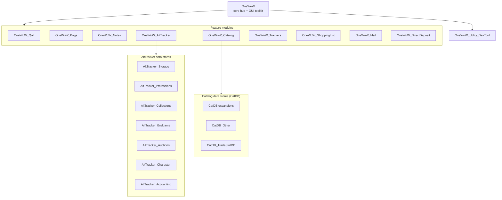

# OneWoW Suite

**A modular World of Warcraft addon suite for Retail 12.1+.** One shared hub, unified themes, eleven locales, and optional feature addons you enable only when you need them.

**Website:** https://onewow.net/

---

## Quick start

1. Install **[OneWoW](OneWoW/README.md)** (required core hub).
2. Copy any optional `OneWoW_*` folders from this package into `World of Warcraft\_retail_\Interface\AddOns\`.
3. Log in and open **OneWoW** (`/1w`) to enable features under **Manage Features**.
4. Configure each addon from its tab in the hub or its slash command.

You do not need every folder — install the addons you want. Companion data stores load with their parent module when enabled.

---

## How it fits together

Separate addons, one product. `OneWoW` is always loaded and hosts the shared UI toolkit (`OneWoW_GUI`). Feature modules are load-on-demand: disabling one in **Manage Features** truly unloads it (not just hides it).

Shared across the suite: **themes**, **11 locales**, and **SavedVariables** conventions via `OneWoW_GUI.DB`. Technical overview: [OneWoW/Docs/ARCHITECTURE.md](OneWoW/Docs/ARCHITECTURE.md).

---

## Addon catalog

### Core (required)

| Addon | Description | Docs |
|-------|-------------|------|
| [OneWoW](OneWoW/README.md) | Central hub — portals, tooltips, collection toasts, universal search, Manage Features | [Docs](OneWoW/Docs/README.md) |

### Feature modules

| Addon | Description | Docs |
|-------|-------------|------|
| [OneWoW_QoL](OneWoW_QoL/README.md) | Quality of life — 34 toggleable modules (automation, UI, social, economy) | [MODULES.md](OneWoW_QoL/MODULES.md) |
| [OneWoW_Bags](OneWoW_Bags/README.md) | Bag organization and inventory management | [Docs](OneWoW_Bags/Docs/README.md) |
| [OneWoW_Notes](OneWoW_Notes/README.md) | Notes for players, NPCs, zones, items, collectibles, and quests | README |
| [OneWoW_AltTracker](OneWoW_AltTracker/README.md) | Account-wide character, gold, profession, and progress tracking | README |
| [OneWoW_Catalog](OneWoW_Catalog/README.md) | Reference database — instances, vendors, professions, recipes | README |
| [OneWoW_Trackers](OneWoW_Trackers/README.md) | Custom tracker lists — guides, dailies, todos, farm value | [Docs](OneWoW_Trackers/Docs/ARCHITECTURE.md) |
| [OneWoW_ShoppingList](OneWoW_ShoppingList/README.md) | Shopping and crafting lists with account-wide stock checks | README |
| [OneWoW_Mail](OneWoW_Mail/README.md) | Mailbox UI, collect/compose, and shipments to characters or roles | [Docs](OneWoW_Mail/Docs/ARCHITECTURE.md) |
| [OneWoW_DirectDeposit](OneWoW_DirectDeposit/README.md) | Automatic Warband Bank gold and item transfers | README |

### Catalog data stores (CatDB)

Companion addons for [OneWoW_Catalog](OneWoW_Catalog/README.md). Enable with Catalog in Manage Features. Pack map: [CATDB.md](OneWoW_Catalog/Docs/CATDB.md). Turning Catalog off stops these packs from loading.

| Addon | Description |
|-------|-------------|
| `OneWoW_CatDB_<Expansion>` | Per-expansion Catalog data (Classic through Midnight). `Data/` and `DataExtra/`. |
| [OneWoW_CatDB_Other](OneWoW_CatDB_Other/README.md) | Unassigned rows. Distro always includes this folder. |
| [OneWoW_CatDB_TradeSkillDB](OneWoW_CatDB_TradeSkillDB) | Tradeskills — professions and recipes |

### AltTracker data stores

Companion addons for [OneWoW_AltTracker](OneWoW_AltTracker/README.md). No standalone UI — data feeds AltTracker tabs.

| Addon | Description |
|-------|-------------|
| [OneWoW_AltTracker_Storage](OneWoW_AltTracker_Storage/README.md) | Bags, banks, and warband storage |
| [OneWoW_AltTracker_Character](OneWoW_AltTracker_Character/README.md) | Character profiles and equipment |
| [OneWoW_AltTracker_Professions](OneWoW_AltTracker_Professions/README.md) | Profession skills, recipes, cooldowns |
| [OneWoW_AltTracker_Collections](OneWoW_AltTracker_Collections/README.md) | Mounts, pets, toys, transmog |
| [OneWoW_AltTracker_Endgame](OneWoW_AltTracker_Endgame/README.md) | M+, delves, endgame progress |
| [OneWoW_AltTracker_Auctions](OneWoW_AltTracker_Auctions/README.md) | Auction house listings |
| [OneWoW_AltTracker_Accounting](OneWoW_AltTracker_Accounting/README.md) | Gold and currency balances |

### Tools

| Addon | Description | Docs |
|-------|-------------|------|
| [OneWoW_Utility_DevTool](OneWoW_Utility_DevTool/README.md) | In-game developer inspector (opt-in) | README |

---

## Documentation

| Audience | Start here |
|----------|------------|
| **Players** | [GitHub Wiki](https://github.com/kellewic/OneWoW_Suite/wiki) · addon `README.md` files in the catalog above |
| **QoL module list** | [OneWoW_QoL/MODULES.md](OneWoW_QoL/MODULES.md) |
| **Contributors** | [CONTRIBUTING.md](CONTRIBUTING.md) |
| **Architecture & APIs** | [OneWoW/Docs/README.md](OneWoW/Docs/README.md) |
| **Locales (11)** | [OneWoW/Docs/LOCALES.md](OneWoW/Docs/LOCALES.md) |

---

## Contributing

See [CONTRIBUTING.md](CONTRIBUTING.md) for code style, locale workflow, pull requests, and original QoL modules. License: [LICENSE.md](LICENSE.md). Community QoL module authors: [MODULE_CREDITS.md](MODULE_CREDITS.md).

## Support

**Website:** https://onewow.net/

**Report issues:** Through Discord community or our website

---

**Author:** OneWoW Development Team

**Website:** https://onewow.net/

**License:** See [LICENSE.md](LICENSE.md). Copyright the OneWoW Development Team except third-party files and community modules that name their own license ([MODULE_CREDITS.md](MODULE_CREDITS.md)). All rights reserved.
